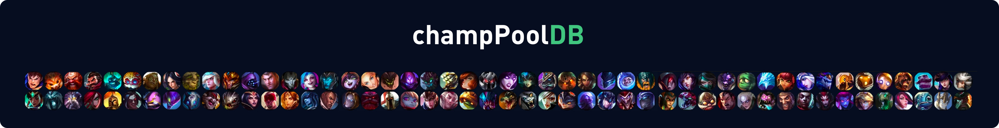

  

  Your personal League of Legends champion-pool database.

## Table of Contents

- [Introduction](#introduction)
- [Features](#features)
- [Feedback](#feedback)

## Introduction

An API to view your champions, add new champions, and get your stats for each champ - all in one database and 100% open source. 
This was created during my time as a student at Code Chrysalis
[You can check out the demo here!](https://champpooldb.herokuapp.com/)

## Features

A few of the things you can do with champPoolDB:

* Create a list of your champions
* Champions have name, stats, tags, and a personal note
* You can delete and add champions any time
* Coming soon: Skills per champion
* Coming soon: Automatic recommendations which champion to master next

## Feedback

Feel free to send us feedback on [Twitter](https://twitter.com/akzlab) or [file an issue](https://github.com/makzent/champPoolDB/issues/new). Feature requests are always welcome. If you wish to contribute, please feel free to add a pull request. 

If there's anything you'd like to chat about, please feel free to ping me on Twitter!
